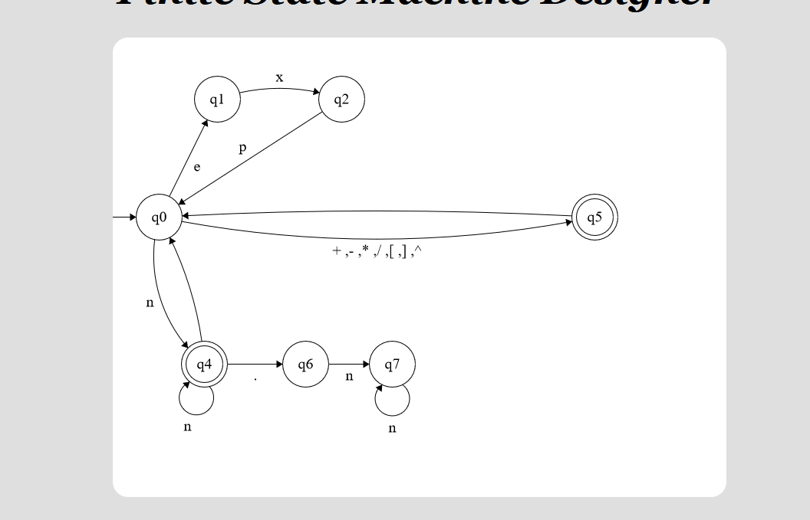

# automatos
###### exemplo de automatos seguido para a construção do analisador léxico, vale resaltar que algumas conexões foram mudadas

* ### automato para o lexico:

# Analisador sintatico

### Removendo recursividade a esquerda da linguagem
* E  -> TE'
* E' -> +TE' | -TE' | e
* T  -> PT'
* T' -> *PT' | /PT' | e
* P  -> EXP[F]P' | FP'
* P' -> ^FP' | e
* F  -> (E) | id

### First da linguagem

* FIRST E -> {exp, (, id}
* FIRST E' -> {+ , - , e}
* FIRST T -> {exp, ( , id}
* FIRST T' -> {*, / , e} 
* FIRST P -> {exp , ( , id}
* FIRST P' -> {^ , e}
* FIRST F -> { ( , id}

### Follow da linguagem

* FOLLOW E = { ) , $}
* FOLLOW E' = FOLLOW E  = { ) , $}
* FOLLOW T = { + , - , ) , $}
* FOLLOW T' = { + , - , ) , $}
* FOLLOW P = { *, / , + , - , ) , $}
* FOLLOW P' = {* , / , + , - , ) , $}
* FOLLOW F = { ] , ^ , * , / , + , - , ) , $}

# Tabela

| NAO T. | id | ( | ) | exp | [ | ] | * | / | + | - | ^ | $ |
| --- | --- | --- | ---- | --- | --- | --- | ---| ---| --- | --- | --- | --- |
| **E** | E -> TE' | E -> TE'| | E -> TE'| | | | | | | | |
| **E'** | | | E'->&| | | | | | E' ->+TE'| E'-> -TE'| | E'->&|
| **T** | T -> PT' |T->PT'|| T -> PT'| | | | | | | | |
| **T'** | | | T' -> &| | | | T' -> *PT' | T' -> /PT'|T' -> &| T' -> &| |T' -> &|
| **P** | P -> FP' |P -> FP' | |P -> exp[F]P' | | | | | | | | |
| **P'** | | |P' -> & | | | P' -> &|P' -> & |P' -> & |P' -> & |P' -> & | P' -> ^FP' | P' -> &|
| **F** |  F -> id |F -> (E) | | | | | | || | | | |